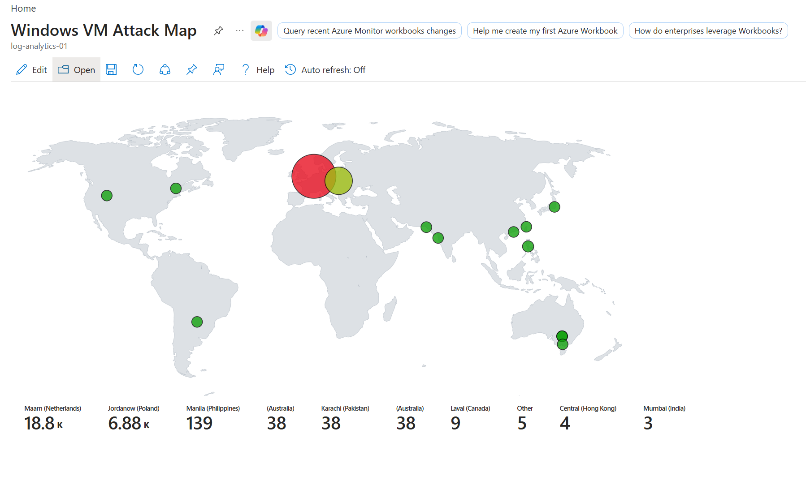
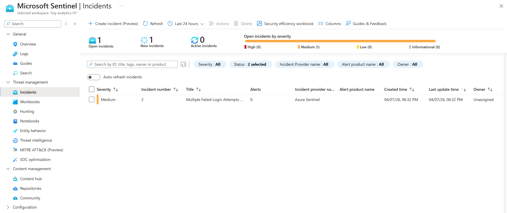
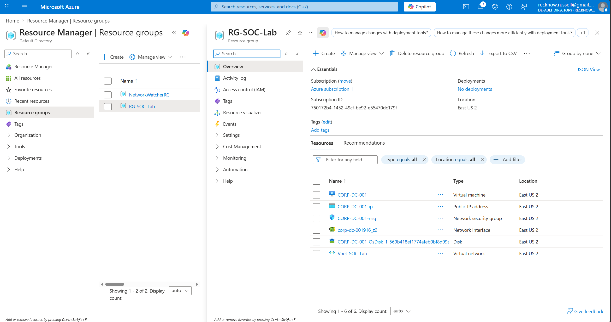
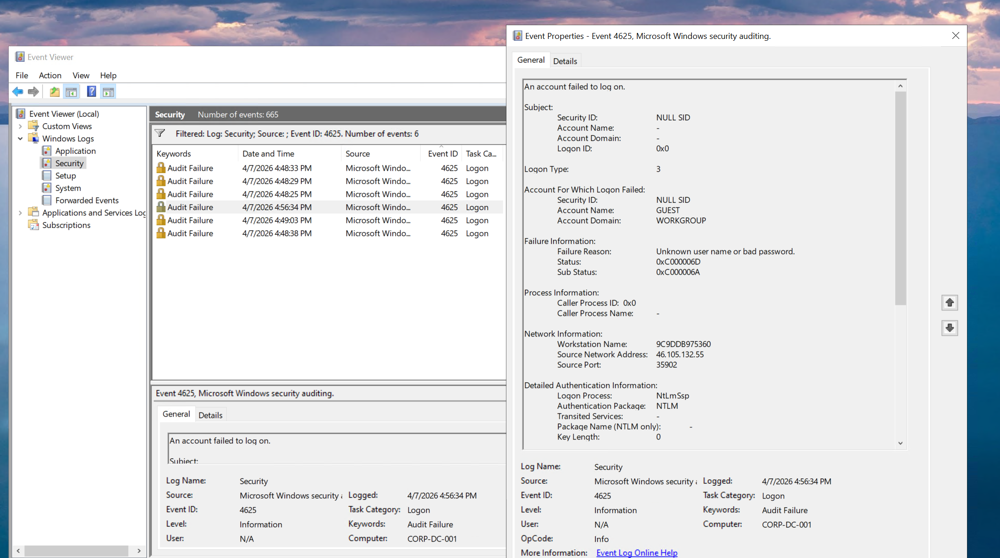
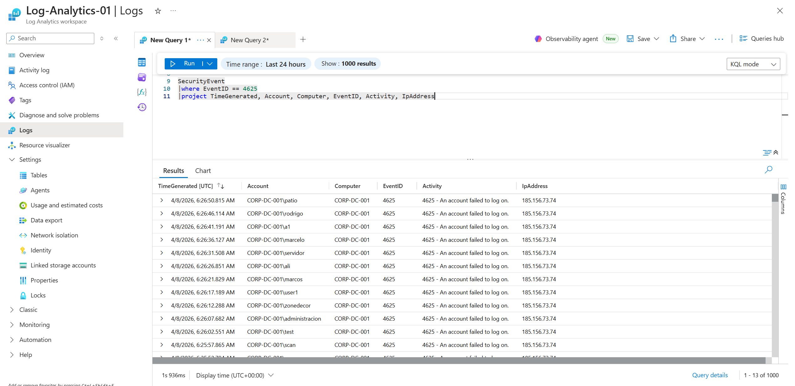

# Azure SOC Home Lab (Microsoft Sentinel)

## Overview
This project demonstrates a cloud-based Security Operations Center (SOC) built in Microsoft Azure. The lab simulates real-world cybersecurity monitoring by deploying a virtual machine as a honeypot and analyzing attack activity using Microsoft Sentinel.

The goal of this project was to gain hands-on experience with log collection, threat detection, and security monitoring in a cloud environment.

---

## Objectives
- Build a cloud-based SOC environment using Microsoft Azure  
- Configure a virtual machine as a honeypot exposed to the internet  
- Collect and centralize logs using Log Analytics Workspace  
- Detect failed login attempts using KQL (Kusto Query Language)  
- Visualize global attack data using geolocation mapping  
- Create and monitor security incidents in Microsoft Sentinel  

---

## Technologies Used
- Microsoft Azure (Virtual Machines, Networking)  
- Microsoft Sentinel (SIEM)  
- Log Analytics Workspace  
- Kusto Query Language (KQL)  
- Windows Event Logs  

---

## Lab Architecture
- Azure Virtual Machine configured as a honeypot  
- Log forwarding to Log Analytics Workspace  
- Microsoft Sentinel used for monitoring and analysis  
- Attack data enriched with geolocation and visualized on a map  

---

## Key Tasks Performed

### 1. Virtual Machine Setup
- Created and configured a Windows VM in Azure  
- Opened necessary ports to allow external traffic for testing  

### 2. Log Collection
- Enabled log forwarding to Log Analytics Workspace  
- Collected Windows Security Event logs  

### 3. Log Analysis with KQL
Used KQL queries to detect failed login attempts:

---

### Screenshots

#### Attack Map

#### Sentinel Incidents View

#### Azure Resource Group / Infrastructure

#### Event Viewer Logs

#### Log Analytics Using KQL

